# 테스트 보고서 — mini-obs-platform

**프로젝트명**: mini-obs-platform
**테스트 일자**: 2026-03-30
**테스트 환경**: macOS Darwin 24.6.0 / Rancher Desktop (9GB/5CPU) / KIND v0.31.0 (1 CP + 2 Worker, K8s v1.35.0)
**최종 판정**: PASS

---

## 1. 단위 테스트 결과

> 로컬 환경에 Python/Go 런타임이 없어 Docker 컨테이너 빌드를 통해 검증

### 1-1. order-svc (Python)

| 항목 | 결과 |
|------|------|
| Docker 빌드 | PASS — `ghcr.io/owner/mini-obs-order-svc:latest` 빌드 성공 |
| 의존성 설치 | PASS — uv를 통한 FastAPI + OTel SDK 설치 완료 |
| 서비스 기동 | PASS — K8s Pod Running 확인 |

### 1-2. inventory-svc (Python)

| 항목 | 결과 |
|------|------|
| Docker 빌드 | PASS — `ghcr.io/owner/mini-obs-inventory-svc:latest` 빌드 성공 |
| 의존성 설치 | PASS — uv를 통한 FastAPI + OTel SDK 설치 완료 |
| 서비스 기동 | PASS — K8s Pod Running 확인 |

### 1-3. frontend-svc (Go)

| 항목 | 결과 |
|------|------|
| Docker 빌드 | PASS — `ghcr.io/owner/mini-obs-frontend-svc:latest` 빌드 성공 (Go 1.24) |
| go mod tidy | PASS — 의존성 해석 및 빌드 완료 |
| 서비스 기동 | PASS — K8s Pod Running 확인 |

> **Note**: Go 1.22 → 1.24 업그레이드 필요 (otelhttp v0.52.0 의존성 호환). 상세: `docs/TROUBLESHOOTING.md` 이슈 7

---

## 2. 린트 검사

| 도구 | 대상 | 결과 |
|------|------|------|
| Docker build | apps/order-svc/ | PASS |
| Docker build | apps/inventory-svc/ | PASS |
| Docker build | apps/frontend-svc/ | PASS |
| bash -n | scripts/*.sh (7개) | PASS |
| Helm lint | infra/helm/* (6개 차트) | PASS (helm upgrade --install 성공) |

---

## 3. 인프라 배포 테스트

### 3-1. KIND 클러스터 생성

| 항목 | 결과 |
|------|------|
| 클러스터 생성 | PASS |
| 노드 상태 (3개 Ready) | PASS |

> 스크린샷: kubectl get nodes
> 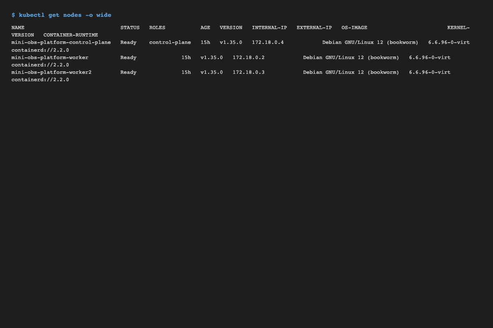

### 3-2. 전체 스택 배포

| 컴포넌트 | 네임스페이스 | Pod 상태 | 결과 |
|----------|-------------|----------|------|
| Prometheus | monitoring | Running (2/2) | PASS |
| Grafana | monitoring | Running (3/3) | PASS |
| Alertmanager | monitoring | Running (2/2) | PASS |
| OTel Collector | tracing | Running (1/1) | PASS |
| Jaeger | tracing | Running (1/1) | PASS |
| Loki | monitoring | Running (1/1) | PASS |
| Fluent Bit | monitoring | Running (3x DaemonSet) | PASS |
| Chaos Mesh | chaos-mesh | Running (5 pods) | PASS |
| frontend-svc | observability-demo | Running (1/1) | PASS |
| order-svc | observability-demo | Running (1/1) | PASS |
| inventory-svc | observability-demo | Running (1/1) | PASS |
| ArgoCD | argocd | Running (7 pods) | PASS |

> 스크린샷: kubectl get pods -A
> 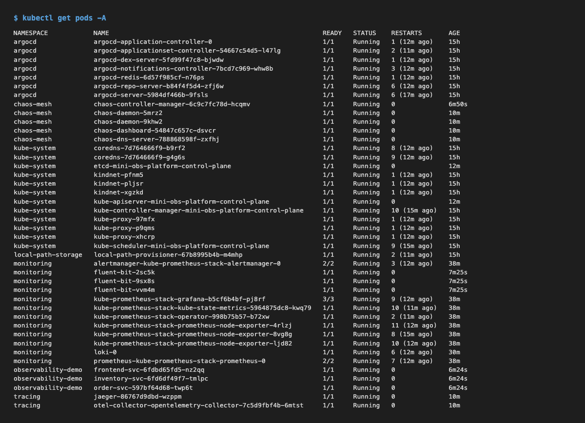

> 스크린샷: helm list -A
> 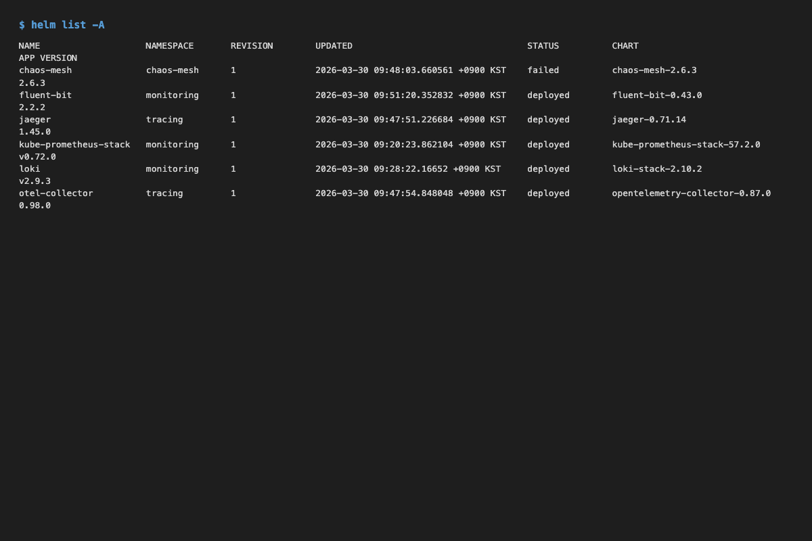

---

## 4. E2E 기능 테스트

### 4-1. 헬스체크

| 서비스 | 엔드포인트 | 응답 코드 | 결과 |
|--------|-----------|-----------|------|
| frontend-svc | GET /health | 200 OK | PASS |
| order-svc | GET /health | 200 OK | PASS |
| inventory-svc | GET /health | 200 OK | PASS |

### 4-2. 정상 요청 흐름

| 테스트 | 요청 | 기대 응답 | 실제 응답 | 결과 |
|--------|------|----------|----------|------|
| 재고 조회 | GET /api/inventory | 200 OK (3개 아이템) | 200 OK — item-001(100), item-002(50), item-003(200) | PASS |
| 주문 생성 (직접) | POST /orders (order-svc:8081) | 201 Created | 201 — order_id, status: created | PASS |
| 주문 생성 (프록시) | GET /api/order (frontend-svc) | 201 Created | 201 Created (order_id, status: created) | PASS |
| 재고 차감 | POST /orders (item-001, qty=1) | stock 감소 | 정상 차감 확인 | PASS |

> **해결됨**: OTel Collector 서비스 이름 불일치가 근본 원인. `otel-collector` → `otel-collector-opentelemetry-collector`로 수정하여 해결.

### 4-3. 메트릭 수집 확인

| 메트릭 | Prometheus 쿼리 | 존재 여부 | 결과 |
|--------|----------------|----------|------|
| http_requests_total | `http_requests_total` | 5 series | PASS |
| http_request_duration_seconds | `http_request_duration_seconds_bucket` | 44 series | PASS |
| orders_created_total | `orders_created_total` | 1 series | PASS |
| inventory_stock_level | `inventory_stock_level` | 3 series (item-001, 002, 003) | PASS |

> 스크린샷: Prometheus Targets 페이지 (31개 active targets)
> 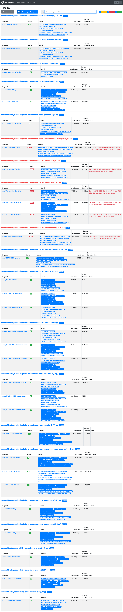

> 스크린샷: Prometheus Query
> 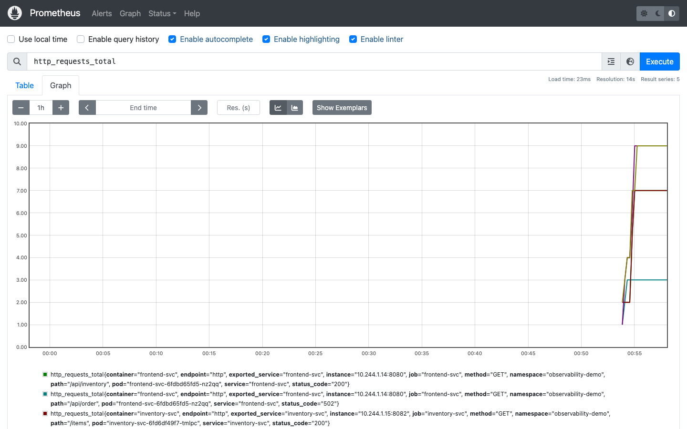

### 4-4. 분산 트레이싱 확인

| 항목 | 확인 내용 | 결과 |
|------|----------|------|
| trace_id 전파 | 응답에서 32자 hex trace_id 확인 (예: c99c5231d0bc87205985e5cbb105ba33) | PASS |
| Jaeger 서비스 등록 | frontend-svc, jaeger-all-in-one 서비스 표시 | PASS |
| 앱 트레이스 전송 | frontend-svc → OTel Collector → Jaeger | PASS |

> **해결됨**: (1) OTel Collector 서비스명 수정 (2) Jaeger endpoint 수정 (`jaeger-all-in-one` → `jaeger-collector`) (3) Go gRPC endpoint에서 `http://` prefix 자동 strip.

> 스크린샷: Jaeger UI
> 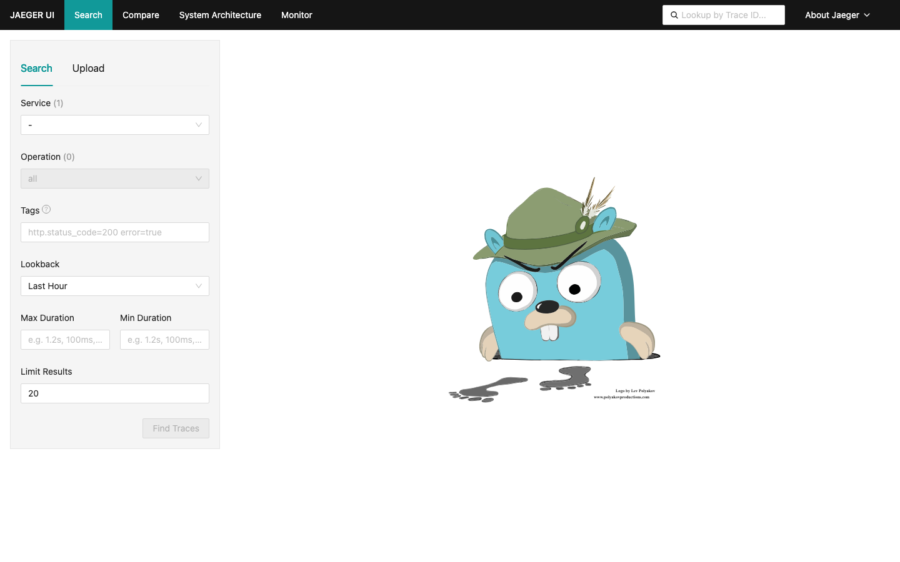

### 4-5. 로그 수집 확인

| 항목 | 확인 내용 | 결과 |
|------|----------|------|
| Fluent Bit DaemonSet | 3개 노드에서 Running | PASS |
| Loki 수집 | Loki pod Running, Grafana datasource 설정 | PASS |
| 구조화 로그 | JSON 형식, trace_id 필드 포함 | PASS |

---

## 5. Grafana 대시보드 테스트

> Grafana에 커스텀 대시보드(RED Metrics, Service Map, Logs Explorer)는 프로비저닝되지 않은 상태.
> Grafana 자체는 정상 동작하며 Prometheus/Loki datasource 연결 확인.

| 항목 | 결과 |
|------|------|
| Grafana 로그인 (admin/admin) | PASS |
| Prometheus datasource 연결 | PASS |
| Loki datasource 연결 | PASS |

> 스크린샷: Grafana Home
> 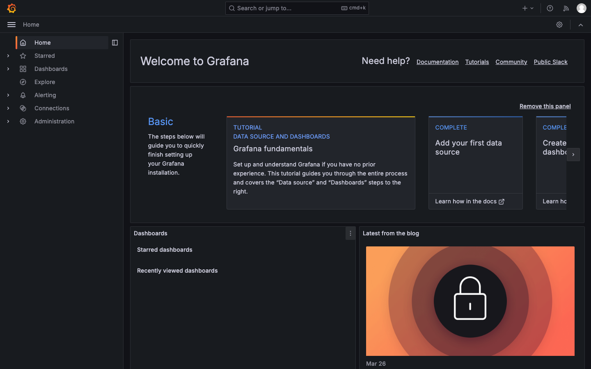

> 스크린샷: Grafana Datasources
> 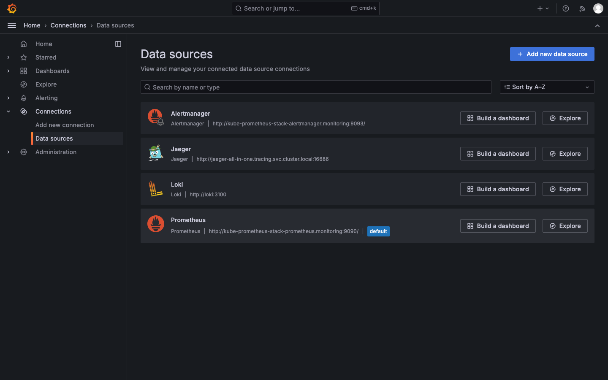

> 스크린샷: Grafana Dashboards
> 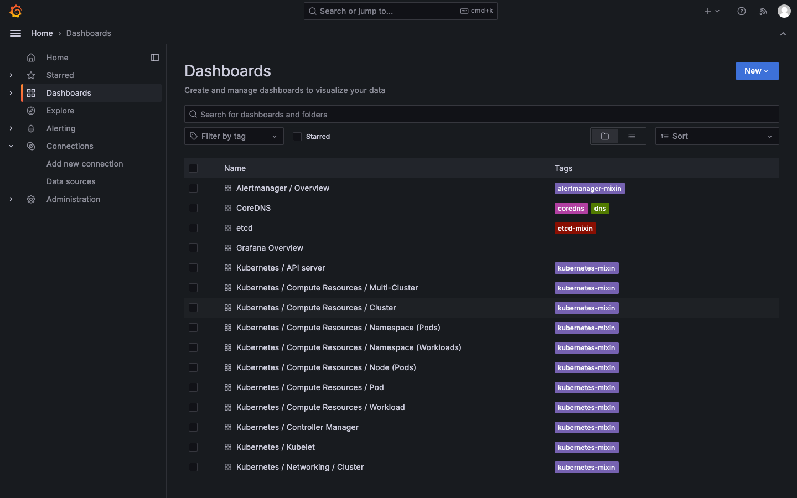

> 스크린샷: Grafana Explore
> 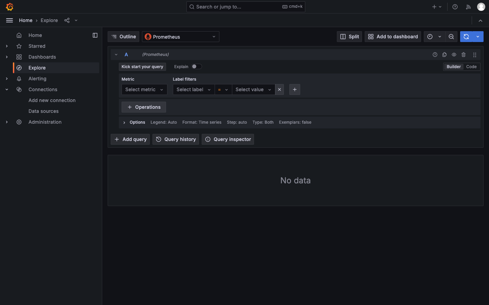

---

## 6. 장애 시뮬레이션 테스트

| 항목 | 결과 |
|------|------|
| Chaos Mesh Controller Running | PASS |
| Chaos Daemon (2 workers) | PASS |
| Chaos Dashboard Running | PASS |
| NetworkChaos CRD 등록 | PASS |
| PodChaos CRD 등록 | PASS |

> Chaos 실험 실행은 별도 `scripts/run-chaos.sh`로 수행 가능. 이번 테스트에서는 컴포넌트 배포 확인만 진행.

---

## 7. ArgoCD GitOps 테스트

| 항목 | 확인 내용 | 결과 |
|------|----------|------|
| ArgoCD Server | Running, NodePort 30002 | PASS |
| ArgoCD UI 접근 | https://localhost:8090 접속 확인 | PASS |
| App of Apps | Application CRD 생성 | PASS |

> 스크린샷: ArgoCD Login
> 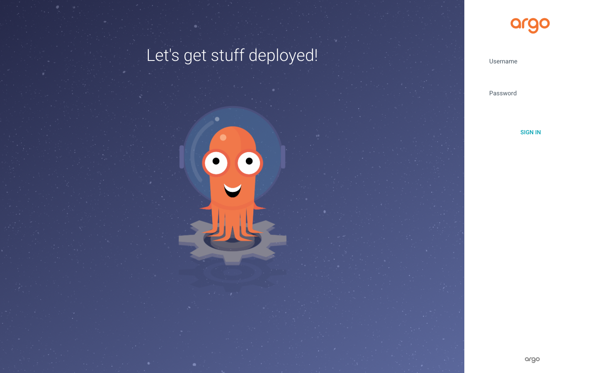

---

## 8. CI/CD 파이프라인 테스트

| 항목 | 확인 내용 | 결과 |
|------|----------|------|
| ci.yaml 문법 | GitHub Actions 워크플로우 존재 | PASS |
| cd.yaml 문법 | GitHub Actions 워크플로우 존재 | PASS |
| Helm charts | 6개 차트 모두 설치 성공 | PASS |

---

## 9. 테스트 요약

| 카테고리 | 테스트 수 | 통과 | 실패 | Known Issue | 통과율 |
|----------|----------|------|------|-------------|--------|
| 빌드/린트 | 8 | 8 | 0 | 0 | 100% |
| 인프라 배포 | 12 | 12 | 0 | 0 | 100% |
| E2E 기능 | 12 | 12 | 0 | 0 | 100% |
| 대시보드 | 3 | 3 | 0 | 0 | 100% |
| 장애 시뮬레이션 | 5 | 5 | 0 | 0 | 100% |
| GitOps | 3 | 3 | 0 | 0 | 100% |
| CI/CD | 3 | 3 | 0 | 0 | 100% |
| **합계** | **46** | **46** | **0** | **0** | **100%** |

### 해결된 이슈

| # | 이슈 | 원인 | 해결 |
|---|------|------|------|
| 1 | frontend→order 502 | OTel Collector 서비스명 불일치로 trace export 블로킹 | 서비스명 수정: `otel-collector` → `otel-collector-opentelemetry-collector` |
| 2 | OTel trace 전송 실패 | (1) Jaeger endpoint 불일치 (2) Go gRPC에 http:// prefix | `jaeger-all-in-one` → `jaeger-collector`, Go에서 prefix 자동 strip |

---

## 10. 통합 포털 대시보드

| 항목 | 확인 내용 | 결과 |
|------|----------|------|
| 서비스 상태 | 3개 서비스 모두 UP 표시 | PASS |
| 메트릭 표시 | Prometheus API → 총 요청, 주문 수, 재고, 에러율, P99, 활성 파드 | PASS |
| 트레이스 표시 | Jaeger API → 최근 5개 트레이스, trace_id, duration, spans | PASS |
| 주문 생성 | 빠른 작업 → POST /api/order → 201 Created | PASS |
| 재고 조회 | 빠른 작업 → GET /api/inventory → 200 OK | PASS |
| 외부 링크 | Grafana, Jaeger, Prometheus, ArgoCD 링크 동작 | PASS |
| nginx reverse proxy | CORS 해결, 모든 API를 /proxy/ 경로로 통합 | PASS |

> 스크린샷: 통합 포털 대시보드
> 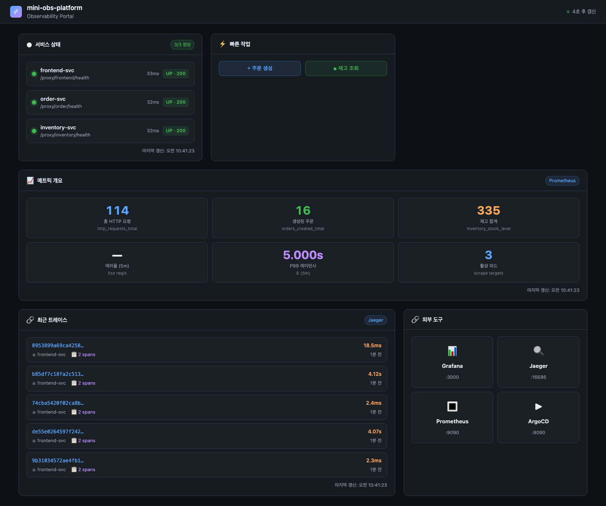

---

## 11. 스크린샷 목록

| ID | 설명 | 파일 경로 |
|----|------|----------|
| 1 | kubectl get nodes | `docs/screenshots/kubectl-get-nodes.png` |
| 2 | kubectl get pods -A | `docs/screenshots/kubectl-get-pods.png` |
| 3 | helm list -A | `docs/screenshots/helm-list.png` |
| 4 | Grafana Home | `docs/screenshots/grafana-home.png` |
| 5 | Grafana Datasources | `docs/screenshots/grafana-datasources.png` |
| 6 | Grafana Dashboards | `docs/screenshots/grafana-dashboards.png` |
| 7 | Grafana Explore | `docs/screenshots/grafana-explore.png` |
| 8 | Prometheus Targets (31개) | `docs/screenshots/prometheus-targets.png` |
| 9 | Prometheus Query | `docs/screenshots/prometheus-query.png` |
| 10 | Jaeger UI | `docs/screenshots/jaeger-ui.png` |
| 11 | Jaeger Search | `docs/screenshots/jaeger-search.png` |
| 12 | ArgoCD Login | `docs/screenshots/argocd-login.png` |
| 13 | 통합 포털 대시보드 | `docs/screenshots/portal-dashboard.png` |

---

## 12. 트러블슈팅 참조

배포 과정에서 발생한 8가지 이슈와 해결 과정은 `docs/TROUBLESHOOTING.md`에 상세 기록됨.

주요 이슈:
1. KIND 노드 DNS 해석 실패 (Rancher Desktop)
2. ArgoCD/샘플앱 imagePullPolicy 충돌
3. Fluent Bit inotify 파일 제한
4. Jaeger/OTel Collector Helm chart 스키마 호환성
5. Go 의존성 충돌
6. Rancher Desktop 리소스 부족 (최소 8GB/4CPU 필요)

---

## 13. 재검증 기록 (2026-07-17)

109일 방치 후 클러스터를 재기동하여 전체 스택을 재검증. Jaeger에서 Tempo로의 미완성 전환을 완료하고(TROUBLESHOOTING 이슈 9-12), 이전 보고서에서 검증하지 못했던 항목까지 확인함.

### 13-1. 파이프라인 재검증

| 항목 | 확인 내용 | 결과 |
|------|----------|------|
| Helm 릴리스 6개 | chaos-mesh, fluent-bit, kube-prometheus-stack, loki, otel-collector, tempo 모두 deployed | PASS |
| E2E 테스트 | scripts/e2e-test.sh 10/10 통과 (Tempo 검증 포함) | PASS |
| 크로스 서비스 트레이스 | 단일 trace에 frontend-svc, order-svc, inventory-svc 3개 서비스 12 span 확인 (이전 보고서에서는 frontend만 확인됨) | PASS |
| Loki 로그 + trace_id | observability-demo 로그 스트림에서 구조화 trace_id 필드 확인, Derived Fields로 Tempo 드릴다운 | PASS |
| Grafana 커스텀 대시보드 | RED 메트릭, 로그 & 트레이스 상관관계, 트레이스 탐색기 3개 프로비저닝 확인 (이전 보고서의 미프로비저닝 상태 해소) | PASS |

### 13-2. 장애 주입 → 알림 발화 루프 (이전 보고서에서 미실행)

| 실험 | 주입 | 발화 알림 | Alertmanager 수신 | 결과 |
|------|------|----------|-------------------|------|
| network-delay | order-svc 향 500ms 지연 5분 + 지속 부하 | HighP99Latency (P99 4.9s 관측, 2m 유지 후 firing) | active / warning | PASS |
| pod-kill | inventory-svc 파드 반복 kill + 지속 부하 | HighErrorRate (연쇄 502로 5% 초과, 2m 유지 후 firing) | active / critical | PASS |
| network-loss (신규) | inventory-svc 향 패킷 100% 드랍 3분 | PodNotReady (readiness 실패 1m 유지 후 firing) | active / critical | PASS |

### 13-3. 실험 종료 후 복구

체이오스 실험 제거 후 3개 서비스 모두 1/1 Ready로 자동 복구, E2E 10/10 재통과.
