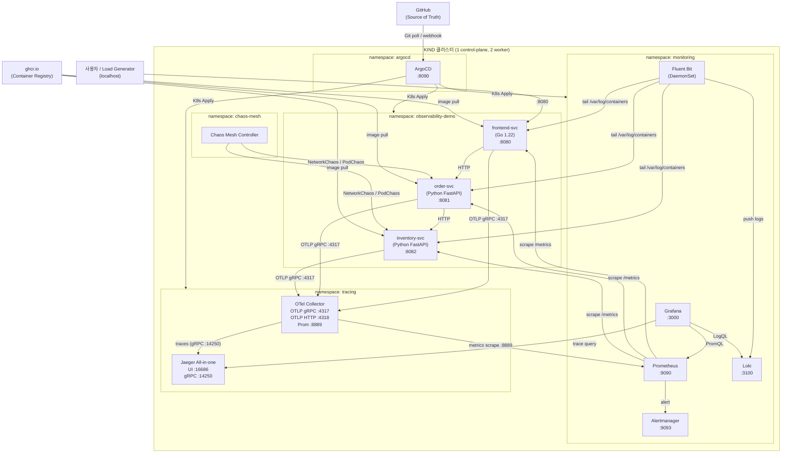
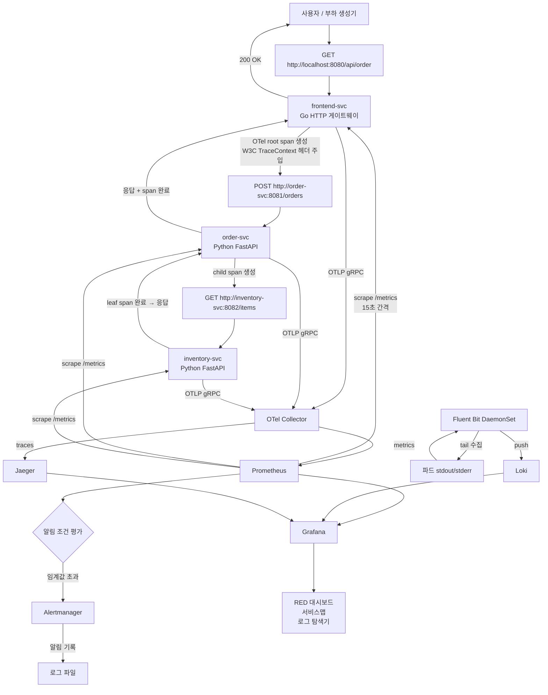
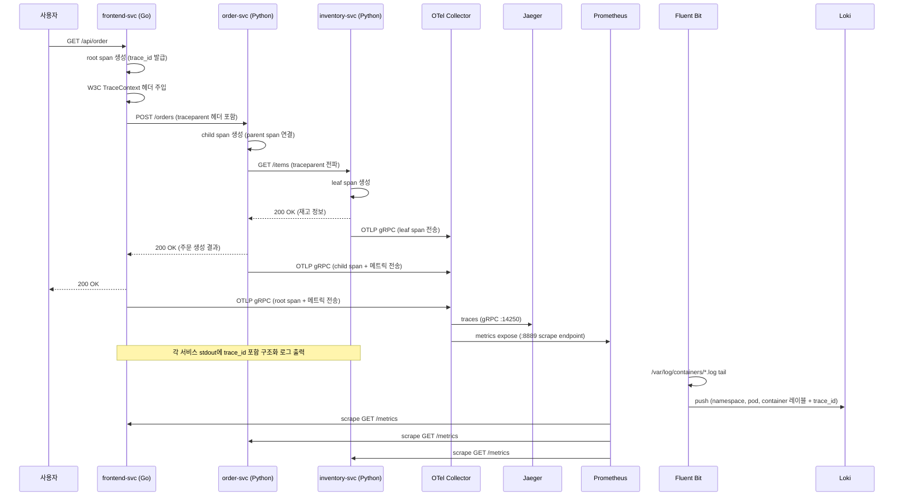
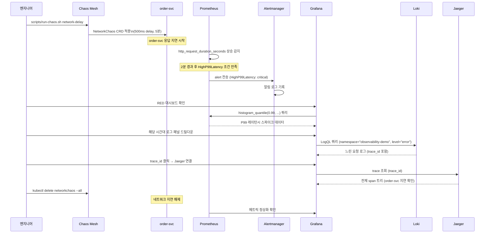
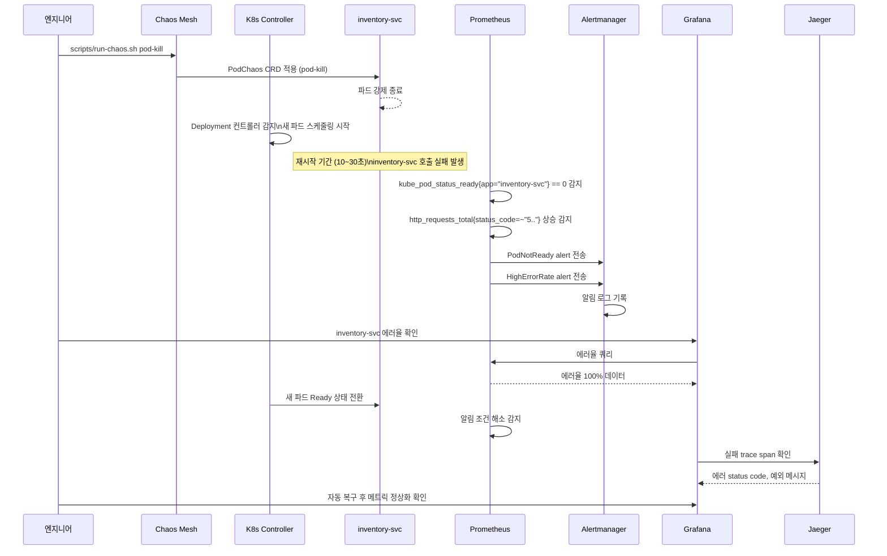
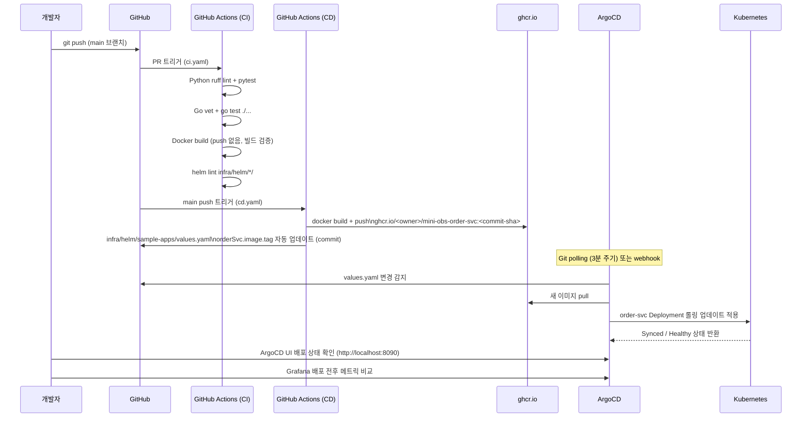
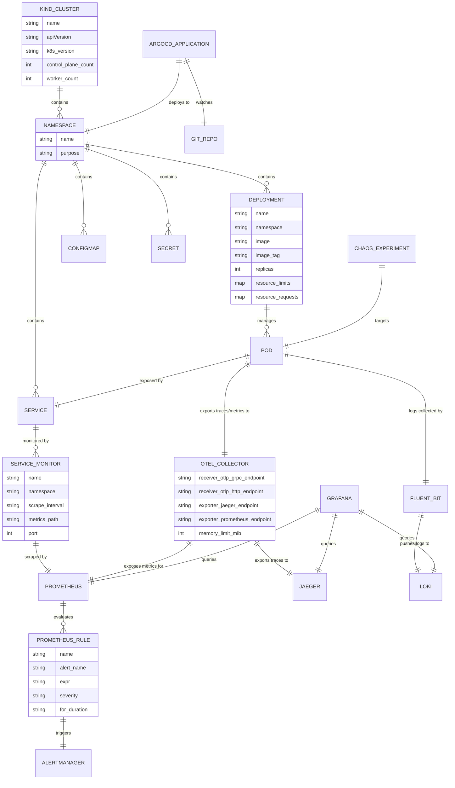

# 서비스 플로우 — mini-obs-platform

---

## 1. 인프라 구성 다이어그램

---

## 2. 전체 서비스 플로우차트

---

## 3. 시나리오별 시퀀스 다이어그램

### 3-1. 정상 요청 흐름 (Traces + Metrics 생성)

---

### 3-2. 장애 감지 흐름 (Chaos → Alert → 분석)

---

### 3-3. Chaos Engineering 흐름 (파드 종료 → 재스케줄링 관찰)

---

### 3-4. GitOps 배포 흐름 (코드 push → CI → ArgoCD → K8s)

---

## 4. 데이터 모델 ERD (인프라 컴포넌트 관계)

